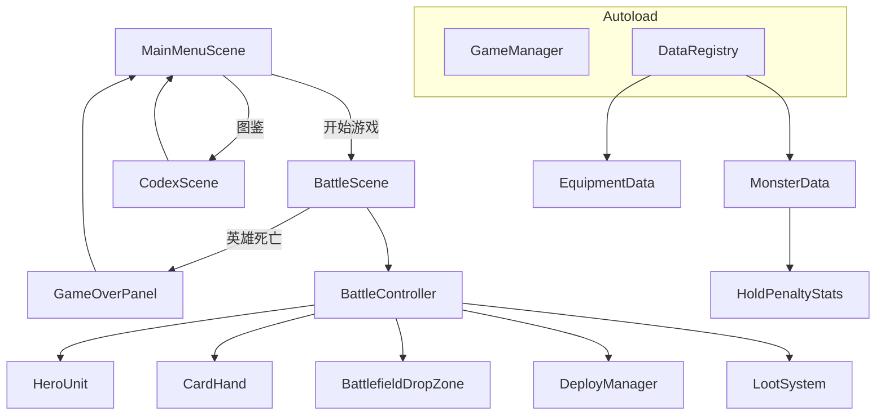
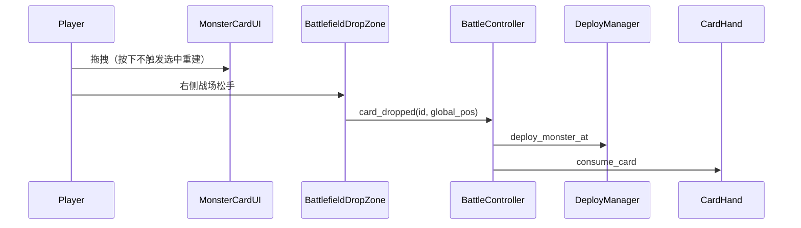

# FreeFight 单机 Demo 开发计划

> **文档角色**：本文件为 Cursor 计划归档 + 里程碑索引；**现行实现细节**以 [`docs/knowledge/README.md`](../../docs/knowledge/README.md) 为准（尤其 [03-战斗系统](](../../docs/knowledge/03-战斗系统.md)、[02-数据层](](../../docs/knowledge/02-数据层.md)、[08-v2-数值初稿](../../docs/knowledge/08-v2-数值初稿.md)）。  
> **边界规则**：[`development-scope.mdc`](../rules/development-scope.mdc)

## 项目现状（截至 v2 完成）

- 引擎：**Godot 4.6**；入口 `res://scenes/main_menu.tscn`
- **已实现**：主菜单 / 图鉴 / 战斗全流程；`assets/` 简单贴图 + `wireframe_theme` 配色
- **部署**：拖拽手牌至 `BattlefieldDropZone` 松手部署（**无** `DeploySlot` / 点击出牌）
- **怪物来源**：仅玩家部署 + 击杀掉落卡牌；**无** `MonsterSpawner` / 自动刷怪
- **v2**：手牌 `HoldPenaltyStats` 持仓负面、哥布林失血、`DISCARD_COOLDOWN_SEC=10` 弃牌
- **英雄基准**：120 HP（`resources/hero_default.tres`）

---

## 目标功能

| 包含（已实现） | 不包含（除非用户明确要求） |
|----------------|---------------------------|
| 主菜单、图鉴、生存战斗 | 技能 / Buff / 元素克制 |
| 拖拽部署、实时普攻 | 部署格、点击即时出牌 |
| 攻/防/HP/攻速、移速 | 自动刷怪、波次胜利 |
| 掉落装备 + 怪物卡（上限 7） | 存档、联网、正式美术包 |
| 持仓负面 + 冷却弃牌 | 分怪掉落池（P1 backlog） |

---

## 架构总览



**核心原则**

- 配置：`Resource` + `.tres`；运行时：单位 `Node` + `base_stats.hp`
- `CombatUnit` 薄基类；`Hero` + `EquipmentInventory`；`Monster` 无装备
- 战斗节拍：`BattleController._physics_process` → `tick_combat`
- 持仓负面：**必须**用 `HoldPenaltyStats`（勿用 `CombatStats` 子资源）

---

## 目录结构（当前）

```
res://
├── autoload/
│   ├── game_manager.gd
│   └── data_registry.gd
├── data/
│   ├── combat_stats.gd
│   ├── hold_penalty_stats.gd    # v2
│   ├── monster_data.gd
│   ├── equipment_data.gd
│   ├── game_config.gd
│   └── game_ids.gd
├── assets/
│   ├── hero.png
│   ├── monsters/{id}.png
│   ├── equipment/{id}.png
│   └── ui/*.png
├── resources/
│   ├── hero_default.tres        # 120 HP
│   ├── monsters/*.tres
│   └── equipment/*.tres
├── scenes/
│   ├── main_menu.tscn
│   ├── codex/codex_scene.tscn
│   └── battle/
│       ├── battle_scene.tscn
│       ├── hero_unit.tscn
│       ├── monster_unit.tscn
│       ├── loot_drop.tscn
│       └── ui/stat_bar.tscn
└── scripts/
    ├── battle/
    │   ├── battle_controller.gd
    │   ├── combat_unit.gd
    │   ├── hero.gd              # refresh_display()
    │   ├── monster.gd
    │   ├── equipment_inventory.gd
    │   ├── card_hand.gd
    │   ├── monster_card_ui.gd
    │   ├── battlefield_drop_zone.gd
    │   ├── deploy_manager.gd
    │   ├── loot_system.gd
    │   └── loot_drop.gd
    └── ui/
        ├── wireframe_theme.gd
        └── wireframe_button.gd
```

**已移除、勿恢复**：`deploy_slot.tscn`、`monster_spawner.gd`、`DeploySlot` 交互。

---

## 数据模型（摘要）

| 类型 | 说明 |
|------|------|
| `CombatStats` | 单位/装备属性；`apply_bonus` / `apply_penalty`（含 `MIN_*` 下限） |
| `HoldPenaltyStats` | 手牌持仓负面，默认 0；`merge_into(sum)` |
| `MonsterData` | `base_stats`、`hold_penalty`、`hold_bleed_per_sec`、`move_speed` |
| `GameConfig` | `ATTACK_RANGE=48`、`DISCARD_COOLDOWN_SEC=10`、`MIN_ATTACK/DEFENSE/ATTACK_SPEED` |

**伤害**：`max(1, atk - def)`（`CombatUnit.try_attack`）

**英雄有效属性**：基础 → 装备 → 持仓负面；StatBar 显示有效值。

物种持仓拍板（详见 08 §3）：史莱姆防 -1；狼攻 -2；哥布林攻 -2 防 -1 失血 0.6/s。

---

## 战斗场景布局（当前）

```
┌─────────────────────────────────────────────────────────┐
│ TopBar: 操作说明 | 存活时间                              │
│ [英雄区-左]              [BattlefieldDropZone-右]        │
│  Sprite2D + StatBar      拖拽松手部署，拖入高亮           │
├─────────────────────────────────────────────────────────┤
│ BottomPanel (VBox):                                      │
│   EquipmentBar → CardHand → HoldSummary → DiscardRow     │
│ BottomBg (贴图)                                          │
└─────────────────────────────────────────────────────────┘
```

---

## 核心流程

### 部署（拖拽）



- 点击选中：松开且移动 < 8px → 用于弃牌；再点同卡取消选中。

### 弃牌（v2）

1. 选手牌 → `BtnDiscard`（冷却 10s 就绪）
2. `discard_card` → 移除卡与持仓负面，重置冷却

### 失血（v2）

`BattleController._tick_hold_bleed`：每秒 `take_damage(max(1, ceil(bleed_sum)))`。

### 掉落

| 概率 | 类型 | 说明 |
|------|------|------|
| 30% | 装备 | 全表随机 id |
| 50% | 卡 | 优先击杀物种 id |
| 20% | 无 | — |

`add_child(drop)` → `setup_*`；手牌满 7 静默失败。

### 失败

英雄 HP ≤ 0 → `GameOverPanel`；`set_physics_process(false)`。

---

## 分阶段里程碑（均已完成）

| 阶段 | 内容 |
|------|------|
| 1 | 骨架、Autoload、Resource、.tres |
| 2 | 主菜单、图鉴 |
| 3 | 战斗布局、StatBar |
| 4 | CombatUnit、Hero/Monster 分化 |
| 5 | **拖拽**手牌 + DeployManager（非部署格） |
| 6 | Game Over；**无** MonsterSpawner |
| 7 | LootSystem、装备、图鉴解锁 |
| 8 | 手牌上限 7、UI 打磨 |
| v2 | HoldPenaltyStats、持仓/失血、弃牌、HoldSummary |

---

## 验收标准（当前 Demo）

1. 主菜单 ↔ 图鉴 ↔ 战斗可切换
2. 拖拽手牌至右侧部署区生成怪物并移向英雄
3. 无自动刷怪；英雄打最近怪，怪进射程普攻
4. 击杀掉落装备/卡；装备同槽覆盖；图鉴解锁
5. 留牌降低英雄有效攻/防；哥布林失血；部署或弃牌后负面消失
6. 弃牌 10s 冷却、无代价；冷却中按钮禁用
7. 英雄死亡 Game Over，可重开或回主菜单

---

## P1 backlog（未实现）

见 [`docs/knowledge/05-依赖与扩展.md`](../../docs/knowledge/05-依赖与扩展.md)：

- 分怪掉落池、落点预览、威胁星级
- 手牌满无拾取提示

---

## 预估工作量（历史）

初版 v1 约 3～4 天；v2 持仓/弃牌约 2.5～3.5 天（均已落地）。后续以 playtest 调表为主（08 §10）。
