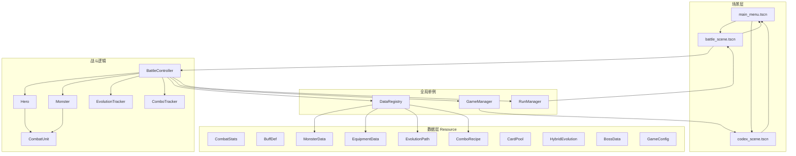

# 架构总览

## 技术栈

- **引擎**：Godot 4.6
- **类型**：2D 线框 Demo（简单贴图 + 主题色 UI；无正式美术包 / 音乐 / 剧情）
- **入口场景**：`res://scenes/main_menu.tscn`

## 分层结构



## 目录树（逻辑模块）

```
res://
├── autoload/              # 跨场景状态与配置加载
│   ├── game_manager.gd
│   ├── data_registry.gd
│   └── run_manager.gd    # Run 结构（4场递进、跨场保留）
├── data/                  # Resource 脚本与游戏常量
│   ├── combat_stats.gd
│   ├── buff_def.gd / buff_instance.gd
│   ├── monster_data.gd
│   ├── equipment_data.gd / equipment_quality.gd / equipment_affix.gd / equipment_instance.gd
│   ├── evolution_path.gd
│   ├── combo_recipe.gd
│   ├── card_pool.gd / card_pool_entry.gd
│   ├── hybrid_evolution.gd
│   ├── boss_data.gd          # Boss 数据定义（4 个 Boss 静态数据）
│   ├── game_config.gd
│   └── game_ids.gd
├── assets/                # 精灵与 UI 贴图（monsters、equipment、ui）
├── resources/             # .tres 实例（怪物、装备、buff、演化、combo、卡池）
├── scenes/                # 场景文件
│   ├── main_menu.tscn
│   ├── codex/
│   └── battle/
├── scripts/
│   ├── main_menu.gd
│   ├── codex_scene.gd
│   ├── battle/            # 战斗核心
│   │   ├── battle_controller.gd
│   │   ├── combat_unit.gd / hero.gd / monster.gd
│   │   ├── buff_container.gd
│   │   ├── equipment_inventory.gd / equipment_backpack.gd
│   │   ├── deploy_manager.gd / battlefield_drop_zone.gd
│   │   ├── card_hand.gd / monster_card_ui.gd
│   │   ├── evolution_tracker.gd
│   │   ├── combo_tracker.gd
│   │   ├── loot_system.gd / loot_drop.gd
│   │   └── projectile.gd
│   └── ui/                # 线框主题与通用 UI 脚本
└── docs/knowledge/        # 本知识目录
```

## Autoload

| 名称 | 脚本 | 职责 |
|------|------|------|
| `GameManager` | `autoload/game_manager.gd` | 场景切换；图鉴解锁列表（怪物 / 装备） |
| `DataRegistry` | `autoload/data_registry.gd` | 启动时扫描 `resources/`，按 `id` 查询怪物/装备/演化/combo 配置 |
| `RunManager` | `autoload/run_manager.gd` | Run 状态管理：4 场递进战斗、难度倍率、跨场保留（HP/装备/演化/混合被动）、Boss 选定 |

## 场景流转

```
主菜单 ──开始游戏──► Boss 预览面板 ──► 战斗场景（第 1 场）
战斗场景 ──胜利──► 战斗场景（第 2 场）... ──第 4 场 Boss 战──► 击杀 Boss ──► 主菜单
战斗场景 ──英雄死亡──► Run 失败面板 ──返回主菜单
主菜单 ──图鉴──────► 图鉴场景 ──返回──► 主菜单
```

## 工具链

### 临时资源生成器 (`tools/`)

```
tools/
├── gen_temp_assets.py    # CLI 入口
├── asset_config.py       # 资源参数配置（颜色、尺寸、输出路径）
└── drawers/              # 各资源绘制模块
    ├── __init__.py       # 注册表 DRAWERS = {name: draw_func}
    ├── common.py         # 共享工具 (put_pixels)
    ├── bat.py / gargoyle.py / skeleton.py / viper.py
    ├── dagger.py / iron_sword.py / chainmail.py
    └── ...
```

**用法**：
```bash
python tools/gen_temp_assets.py              # 生成全部
python tools/gen_temp_assets.py skeleton viper  # 按名字生成
```

**新增资源步骤**：
1. `asset_config.py` → `ASSETS` 字典添加条目（size / output / colors）
2. `drawers/` 下新建模块，导出 `draw(img, d, config)` 函数
3. `drawers/__init__.py` 注册到 `DRAWERS`

## 核心设计原则

1. **配置与运行时分离**：静态数值在 `.tres` + `Resource`；运行时 HP、位置在 `Node`。
2. **战斗单位薄基类**：`CombatUnit` 只管普攻 / 受伤 / 死亡；英雄与怪物分脚本扩展。
3. **装备不进基类**：仅 `Hero` 组合 `EquipmentInventory`，`Monster` 无装备槽。
4. **战斗节拍统一**：`BattleController._physics_process` 驱动英雄与怪物的 `tick_combat`。
5. **演化属性直接修改**：演化/混合被动直接改英雄属性（非 buff），通过 RunManager 跨场保留。
