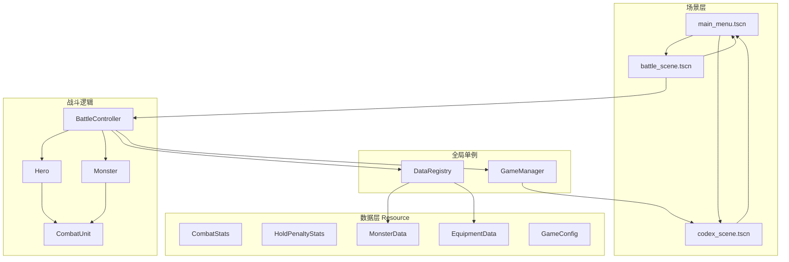

# 架构总览

## 技术栈

- **引擎**：Godot 4.6
- **类型**：2D 线框 Demo（简单贴图 + 主题色 UI；无正式美术包 / 音乐 / 剧情）
- **入口场景**：`res://scenes/main_menu.tscn`

## 分层结构



## 目录树（逻辑模块）

```
res://
├── autoload/              # 跨场景状态与配置加载
├── data/                  # Resource 脚本与游戏常量（含 hold_penalty_stats.gd）
├── assets/                # 精灵与 UI 贴图（monsters、equipment、ui）
├── resources/             # .tres 实例（怪物、装备、英雄默认属性）
├── scenes/                # 场景文件
│   ├── main_menu.tscn
│   ├── codex/
│   └── battle/
├── scripts/
│   ├── main_menu.gd
│   ├── codex_scene.gd
│   ├── battle/            # 战斗核心
│   └── ui/                # 线框主题与通用 UI 脚本
└── docs/knowledge/        # 本知识目录
```

## Autoload

| 名称 | 脚本 | 职责 |
|------|------|------|
| `GameManager` | `autoload/game_manager.gd` | 场景切换；图鉴解锁列表（怪物 / 装备） |
| `DataRegistry` | `autoload/data_registry.gd` | 启动时扫描 `resources/`，按 `id` 查询配置 |

## 场景流转

```
主菜单 ──开始游戏──► 战斗场景
主菜单 ──图鉴──────► 图鉴场景 ──返回──► 主菜单
战斗场景 ──英雄死亡──► Game Over ──返回主菜单 / 重新开始
```

## 核心设计原则

1. **配置与运行时分离**：静态数值在 `.tres` + `Resource`；运行时 HP、位置在 `Node`。
2. **战斗单位薄基类**：`CombatUnit` 只管普攻 / 受伤 / 死亡；英雄与怪物分脚本扩展。
3. **装备不进基类**：仅 `Hero` 组合 `EquipmentInventory`，`Monster` 无装备槽。
4. **战斗节拍统一**：`BattleController._physics_process` 驱动英雄与怪物的 `tick_combat`。
