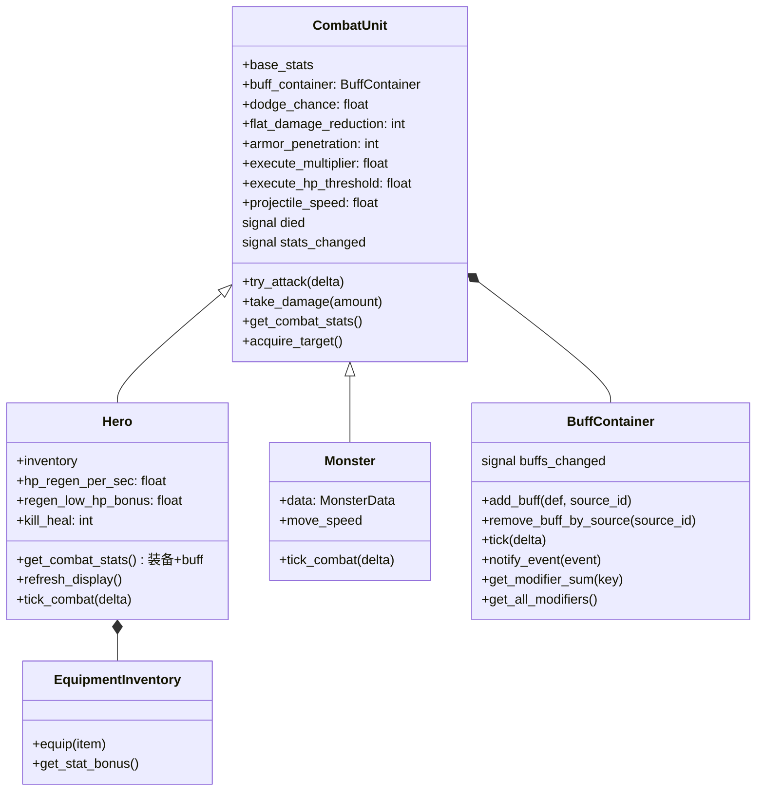
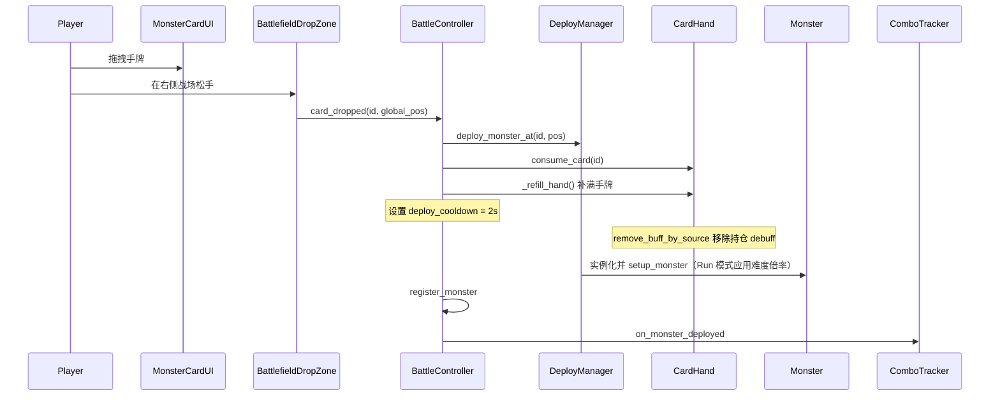

# 战斗系统

战斗场景根节点：`scenes/battle/battle_scene.tscn`  
总线脚本：`scripts/battle/battle_controller.gd`

## 模块一览

| 模块 | 脚本 | 职责 |
|------|------|------|
| `BattleController` | `battle_controller.gd` | 战斗总线：生存计时、失血 tick、弃牌/部署冷却、buff tick、统一 `tick_combat`、注册怪物、演化/combo/混合 UI、Run 流程、Boss 预览/战斗/特效、Game Over |
| `CombatUnit` | `combat_unit.gd` | 薄基类：HP、受伤（含闪避/减伤）、攻速普攻（含穿甲/处决）、远程弹射、`died` 信号、`buff_container` |
| `Hero` | `hero.gd` | 英雄：有效战斗属性（装备 + buff）、选最近怪物、HP 回复、`refresh_display()` |
| `Monster` | `monster.gd` | 怪物：按 `move_speed` 移向英雄，进入范围后普攻 |
| `BuffContainer` | `buff_container.gd` | Buff 管理器节点：添加/移除/tick/事件通知/属性汇总 |
| `EquipmentInventory` | `equipment_inventory.gd` | 武器 + 护甲槽，`equip()` 同槽覆盖，`get_stat_bonus()` |
| `DeployManager` | `deploy_manager.gd` | 在拖放落点实例化怪物，应用难度倍率，发射 `monster_deployed` / `monster_deployed_with_zone` |
| `CardHand` | `card_hand.gd` | 手牌列表/UI，上限 7，通过 BuffContainer 施加持仓 debuff |
| `MonsterCardUI` | `monster_card_ui.gd` | 拖拽源 + 点击选中（见下文） |
| `BattlefieldDropZone` | `battlefield_drop_zone.gd` | 右侧战场接收拖放 |
| `LootSystem` | `loot_system.gd` | 怪物死亡 roll 掉落，品质受部署距离（近/中/远）影响 |
| `EvolutionTracker` | `evolution_tracker.gd` | 统计击杀数，检查演化阈值（3 阶），检查混合被动 |
| `ComboTracker` | `combo_tracker.gd` | 追踪 4s 内部署序列，匹配 combo 配方 |

## 类关系（战斗单位）



## Buff 系统

### BuffContainer（`scripts/battle/buff_container.gd`）

挂在每个 CombatUnit 节点下的 Buff 管理器：

| 方法 | 说明 |
|------|------|
| `add_buff(def, source_id)` | 添加 buff；同 id+source 时叠层或刷新时间 |
| `remove_buff_by_source(source_id)` | 按来源移除（手牌持仓用） |
| `remove_buff_by_id(buff_id)` | 按 buff id 移除所有实例 |
| `tick(delta)` | TIMED 类型倒计时，到期自动移除 |
| `notify_event(event)` | COUNTED 类型消耗，到 0 自动移除 |
| `get_modifier_sum(key)` | 指定属性的总修改量 |
| `get_all_modifiers()` | 所有属性修改的 Dictionary |
| `get_bleed_per_sec()` | 便捷：`get_modifier_sum(&"bleed_per_sec")` |

### 属性修改流

```
BuffDef.modifiers = {"attack": -1, "bleed_per_sec": 0.3}
                          ↓
BuffInstance.get_modifier("attack") = -1 × stacks
                          ↓
BuffContainer.get_all_modifiers() = 所有实例求和
                          ↓
Hero.get_combat_stats(): base + equipment + buff_modifiers → clamp MIN_*
```

### 三种持续类型

| 类型 | 移除条件 | 使用场景 |
|------|----------|----------|
| `PERMANENT` | 由外部代码显式移除 | 手牌持仓、装备被动 |
| `TIMED` | `BuffContainer.tick()` 倒计时到 0 | 限时增益/减益（combo buff） |
| `COUNTED` | `notify_event()` 消耗次数到 0 | N 次攻击后消失的 buff |

## 战斗循环

**驱动方**：`BattleController._physics_process(delta)`

1. 若未 Game Over：更新存活秒数；部署/弃牌冷却递减。
2. `_tick_hold_bleed(delta)`：从 `hero.buff_container.get_bleed_per_sec()` 读取，每秒 `Hero.take_damage(max(1, ceil(bleed)))`。
3. `hero.buff_container.tick(delta)`：处理 TIMED buff 倒计时。
4. `_hero.tick_combat(delta)` → 选最近怪物，距离 ≤ 350px 则远程弹射攻击。
5. 遍历 `_monsters`：存活则 `monster.tick_combat(delta)`。
   - 距离 > `ATTACK_RANGE(48px)`：向英雄移动，`global_position += dir * move_speed * delta`。
   - 否则：`try_attack(delta)`。
6. 检查胜利条件（Run 模式下）。
7. 刷新进度 UI。

英雄与怪物**共用** `CombatUnit.try_attack` 的计时与伤害逻辑。

### 英雄有效属性（`Hero.get_combat_stats()`）

顺序：**基础** `base_stats` → **装备** `apply_bonus` → **Buff** `buff_container.get_all_modifiers()` → **clamp** `MIN_*`。

- `hp` 始终来自 `base_stats.hp`（受伤/失血改的是 `base_stats`）。
- `max_hp` 取 `max(叠加后 max_hp, base_stats.max_hp)`；换装后 `base_stats.hp = mini(hp, effective.max_hp)`。

### 英雄额外属性

| 属性 | 默认 | 来源 |
|------|------|------|
| `dodge_chance` | 0.0 | 幽影演化 |
| `flat_damage_reduction` | 0 | 磐石演化 |
| `armor_penetration` | 0 | 剧毒演化 |
| `execute_multiplier` | 1.0 | 凶残演化 |
| `execute_hp_threshold` | 0.3 | 凶残演化 |
| `hp_regen_per_sec` | 0.0 | 共生演化 |
| `regen_low_hp_bonus` | 1.0 | 共生 Tier III |
| `kill_heal` | 0 | 亡灵/追猎演化、混合被动 |

## 部署流程（拖拽手牌）



- **无部署格**：落点 = 松开时的全局坐标。
- **无自动刷怪**：敌人仅来自玩家部署。
- **每卡独立冷却**：初始手牌无 CD，新抽到的卡有 8s CD（`GameConfig.CARD_COOLDOWN_SEC`）。CD 期间卡面显示遮罩+倒计时，无法拖拽。
- **满手补牌**：部署后立即从 `CardPool` 随机补满 7 张手牌。

### 部署区域（距离风险）

| 区域 | X 范围 | 掉落品质 |
|------|--------|----------|
| 近距离 | < 700px | 更高品质 |
| 中距离 | 700-950px | 标准品质 |
| 远距离 | > 950px | 较低品质 |

### 拖拽 vs 点击选中

`MonsterCardUI`：

- **拖拽**：`_get_drag_data()` 返回 `{"monster_id": ...}`。
- **点击**：仅在**左键松开**且移动距离 **< 8px** 时 `card_clicked` → `CardHand.set_selected`（再点同卡取消选中）。按下时不触发，避免 `_rebuild_ui()` 打断拖拽。

### 手牌持仓压力（Buff 系统实现）

- 每张怪卡加入手牌时，通过 `CardHand` 在 Hero 的 `BuffContainer` 上添加一个 PERMANENT debuff 实例（`source_id` 唯一标识每张卡）。
- 部署（`consume_card`）或弃牌（`discard_card`）时，通过 `remove_buff_by_source` 精确移除对应 debuff。
- UI：卡面「拿着:…」、`UI/BottomPanel/HoldSummary`、`DiscardRow/BtnDiscard` + `DiscardCooldown`。

### 弃牌流程

1. 点击手牌选中（高亮边框）；再点取消选中。
2. 冷却就绪时点 `BtnDiscard` → `discard_card(selected_id)` → 重置 `DISCARD_COOLDOWN_SEC`。
3. 无扣血、无额外 debuff；冷却中按钮禁用，Label 显示剩余秒数。

## 演化系统

### EvolutionTracker

- 统计每种怪物的击杀数（`kill_counts`）
- 击杀时检查所有路径阈值，触发 Tier I/II/III 演化
- Tier I 触发后额外检查混合被动条件
- 信号：`evolution_triggered(path_id, tier)`、`kill_count_changed`、`hybrid_triggered(hybrid_id)`

### 演化效果

由 `BattleController._apply_evolution_effect(path_id, tier)` 直接修改英雄属性（非 buff），跨场保留。

### 混合被动

两条路径都达到 Tier I 时自动解锁。由 `HybridEvolution.get_all()` 静态定义 8 个混合。效果通过 `_apply_hybrid_effect(hybrid_id)` 应用，同样跨场保留。

## Combo 系统

### ComboTracker

- 记录 4s（`COMBO_WINDOW_SEC`）内的部署序列
- 每次部署时检查最近 2 只是否匹配 `ComboRecipe`
- 信号：`combo_triggered(recipe, monster)`

### Combo 效果类型

| 类型 | 说明 |
|------|------|
| `MONSTER_HP_MULT` | 目标怪物 HP 缩减（如 ×0.3） |
| `MONSTER_STUN` | 目标怪物眩晕（秒） |
| `HERO_BUFF_DEFENSE` | 英雄防御临时 buff（3s） |
| `HERO_BUFF_ATTACK_SPEED` | 英雄攻速临时 buff（3s） |
| `HERO_BUFF_ATTACK` | 英雄攻击临时 buff（3s） |

## Run 结构

### RunManager（Autoload）

管理 4 场递进战斗的 Run 流程：

| 参数 | 值 |
|------|-----|
| `TOTAL_BATTLES` | 4 |
| `HEAL_BETWEEN_BATTLES` | 0.2（20% max_hp） |
| `MIN_BATTLE_TIME` | 90s |
| `KILL_REQUIREMENTS` | [15, 18, 22, 25] |
| `DIFFICULTY_MULTIPLIERS` | [1.0, 1.2, 1.5, 2.0] |

### 胜利条件

**前 3 场（养成阶段）**：
1. 存活时间 ≥ `MIN_BATTLE_TIME`
2. 击杀数 ≥ 当场 `KILL_REQUIREMENTS`
3. 场上无存活怪物

**第 4 场（Boss 战）**：
- 击杀 Boss 即胜利（不检查存活时间和击杀数）
- Boss 死亡触发 Run 通关

### 跨场保留

通过 `RunManager.save_battle_state()` / `_restore_run_state()` 保存恢复：

- 英雄 HP、装备、背包
- 所有演化属性（dodge_chance、flat_damage_reduction、armor_penetration 等）
- 演化进度（kill_counts、active_evolutions）
- 混合被动（active_hybrids）

### 难度递增

`DeployManager` 在 Run 模式下对怪物应用 `DIFFICULTY_MULTIPLIERS`，按倍率提升怪物攻击和 HP。

## Boss 系统

### BossData（`data/boss_data.gd`）

Boss 数据用 `RefCounted`，静态方法 `get_all()` 返回 4 个 Boss 定义（与 `HybridEvolution` 相同模式）。

| 字段 | 类型 | 说明 |
|------|------|------|
| `id` | StringName | Boss 唯一标识 |
| `display_name` | String | 显示名称 |
| `description` | String | Boss 描述 |
| `base_stats` | CombatStats | 基础属性（HP/攻/防/攻速） |
| `wireframe_color` | Color | 线框主题色 |
| `move_speed` | float | 移动速度 |
| `traits` | Array[Dictionary] | 特性列表（`{name, desc}`） |
| `counter_hint` | String | 克制提示 |
| `flat_damage_reduction` | int | 固定减伤（亡灵护盾） |
| `aura_bleed` | float | 光环失血/s（腐蚀光环） |
| `regen_per_sec` | float | 每秒回血（再生） |
| `summon_interval` | float | 召唤间隔（0=不召唤） |
| `summon_monster_id` | StringName | 召唤的怪物类型 |

### 4 个 Boss

| Boss | HP | 攻 | 防 | 攻速 | 特殊机制 | 克制思路 |
|------|-----|-----|-----|------|----------|----------|
| 铁甲巨兽 | 500 | 12 | 8 | 0.6 | 高防、慢速 | 剧毒(穿甲)、凶残(处决) |
| 暗影刺客 | 250 | 20 | 2 | 2.0 | 极高攻速、脆弱 | 磐石(减伤)、幽影(闪避) |
| 腐朽巫师 | 350 | 8 | 3 | 1.0 | 光环失血3/s、回血5/s | 凶残(处决)、追猎(攻速buff) |
| 亡灵领主 | 400 | 15 | 5 | 1.2 | 减伤4、每15s召唤骷髅 | 剧毒(穿甲)、共生(回复) |

### Run 流程（含 Boss）

```
开始 Run → Boss 随机选定（RunManager.current_boss）
  ↓
第 1 场开始前：Boss 预览面板（展示名称/属性/特性/克制提示）
  ↓
第 1-3 场：养成战斗（与普通战斗相同）
  ↓
第 4 场：Boss 战（Boss 自动出现在战场，击杀 Boss 即胜利）
  ↓
Run 通关
```

### Boss 预览面板

第 1 场 `_ready()` 时弹出全屏覆盖面板：
- Boss 名称（Boss 主题色）+ 描述
- 属性条（HP/攻/防/攻速）
- 特性列表（名称 + 描述）
- 克制提示
- "开始挑战" 按钮（点击关闭面板，恢复战斗）
- 期间 `set_physics_process(false)` 暂停战斗

### Boss 战（第 4 场）

- Boss 用 `Monster` 实例（复用 `monster_unit.tscn`），Body sprite 放大 2.5 倍
- Boss 自动出现在战场右侧（x=1000, y=300）
- 顶部 Boss 血条 UI（ProgressBar + Label）
- 玩家仍可继续部署普通怪物（养成 + combo 系统仍生效）

### Boss 特效 Tick

`BattleController._tick_boss_effects(delta)` 每帧处理：
- **腐蚀光环**：每秒对英雄造成 `ceil(aura_bleed)` 伤害
- **再生**：每帧回复 `regen_per_sec * delta` HP（不超过 max_hp）
- **召唤**：每 `summon_interval` 秒在 Boss 附近生成一只怪物（应用难度倍率）

## 掉落与拾取

`LootSystem.on_monster_died(monster, zone)`（先 `GameManager.unlock_monster`）：

| 概率 | 类型 | 效果 |
|------|------|------|
| 60% | 装备 | 从**全装备表随机** id，生成带品质+词缀的 `EquipmentInstance` |
| 40% | 无 | — |

掉落时自动 roll 品质（白50/绿30/蓝15/紫5）和前缀词缀（50%无/50%随机适用词缀）。近距离部署掉落品质更高。

### 装备背包

- 装备掉落后**自动进入背包**（`EquipmentBackpack`，8 格），不再生成地面掉落物。
- 背包满时丢弃**最早获得**的装备，新装备加入末尾。
- 底部 UI 显示 8 个按钮格子，品质色文字。
- **点击格子** → 装备穿上（`inventory.equip`），旧装备直接丢弃（不回背包）。
- **鼠标悬停** → 浮动面板显示装备属性（名称、品质、攻/防/HP/攻速加成）。

### 装备栏

- `EquipmentInventory`：武器 + 护甲各一槽，存 `EquipmentInstance`。
- `_refresh_equipment_bar()` 显示品质色名称；悬停同样显示属性面板。

## Game Over

触发：`Hero` HP ≤ 0 → `died` 信号。

`BattleController`：

- Run 模式：显示结果面板（含存活时间、击杀数、演化信息），可回主菜单。
- 非 Run 模式：显示 `GameOverPanel`，可重新开始或回主菜单。
- `set_physics_process(false)` 停止战斗节拍。
- `_stop_monster_activity()` 关闭所有怪物逻辑。

## 场景内节点（战斗）

```
BattleScene (Node2D, battle_controller.gd)
├── Units/
│   ├── Hero          (hero_unit.tscn → 含 BuffContainer)
│   ├── Monsters      (动态 monster_unit.tscn → 含 BuffContainer)
│   └── Projectiles   (动态弹射物)
├── DeployManager
├── LootSystem
└── UI/ (CanvasLayer)
    ├── TopBar/TopLabel, SurvivalLabel
    ├── HeroZoneFrame
    ├── BattlefieldDropZone
    ├── EvolutionPanel         (动态创建，演化进度条)
    ├── HybridPanelLabel       (动态创建，混合被动显示)
    ├── EvolutionLabel         (动态创建，演化触发提示)
    ├── ComboLabel             (动态创建，combo 触发提示)
    ├── DeployCooldownLabel    (动态创建，部署冷却)
    ├── ProgressPanel          (动态创建，击杀/时间进度，Run 模式)
    ├── BossHPBarContainer     (动态创建，Boss 血条，仅 Boss 战)
    ├── BossPreviewOverlay     (动态创建，Boss 预览面板，仅第 1 场)
    ├── BottomBg
    ├── BottomPanel/
    │   ├── EquipmentBar
    │   ├── CardHand
    │   ├── HoldSummary
    │   └── DiscardRow
    ├── BackpackPanel          (动态创建，8格背包)
    └── BattleResultPanel      (动态创建，胜利/失败)
```
