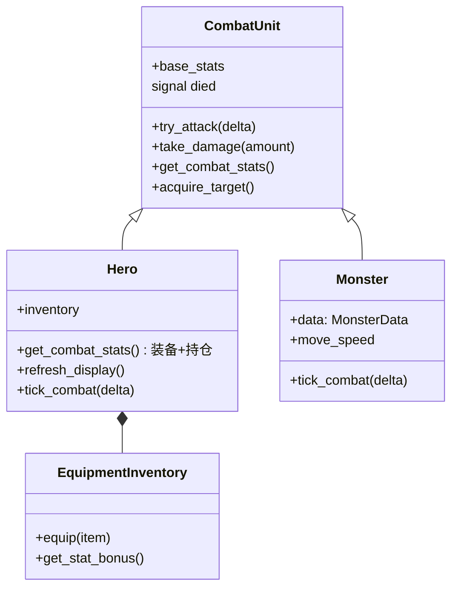
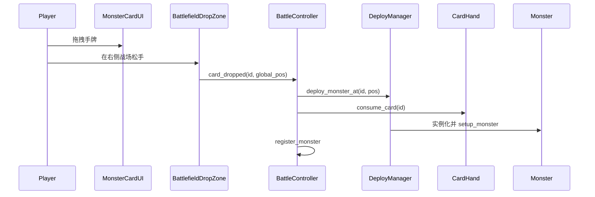

# 战斗系统

战斗场景根节点：`scenes/battle/battle_scene.tscn`  
总线脚本：`scripts/battle/battle_controller.gd`

## 模块一览

| 模块 | 脚本 | 职责 |
|------|------|------|
| `BattleController` | `battle_controller.gd` | 战斗总线：生存计时、失血 tick、弃牌冷却、统一 `tick_combat`、注册怪物、Game Over |
| `CombatUnit` | `combat_unit.gd` | 薄基类：HP、受伤、攻速普攻、`died` 信号 |
| `Hero` | `hero.gd` | 英雄：有效战斗属性、选最近怪物、`refresh_display()` |
| `Monster` | `monster.gd` | 怪物：按 `move_speed` 移向英雄，进入范围后普攻 |
| `EquipmentInventory` | `equipment_inventory.gd` | 武器 + 护甲槽，`equip()` 同槽覆盖，`get_stat_bonus()` |
| `DeployManager` | `deploy_manager.gd` | 在拖放落点实例化怪物，发射 `monster_deployed`（暂无监听） |
| `CardHand` | `card_hand.gd` | 手牌列表/UI，上限 7，`hold_penalty_changed` |
| `MonsterCardUI` | `monster_card_ui.gd` | 拖拽源 + 点击选中（见下文） |
| `BattlefieldDropZone` | `battlefield_drop_zone.gd` | 右侧战场接收拖放 |
| `LootSystem` | `loot_system.gd` | 怪物死亡 roll 掉落、处理拾取 |
| `LootDrop` | `loot_drop.gd` | 掉落物 `Area2D`，点击拾取 |

## 类关系（战斗单位）



## 战斗循环

**驱动方**：`BattleController._physics_process(delta)`

1. 若未 Game Over：更新存活秒数；弃牌冷却递减。
2. `_tick_hold_bleed(delta)`：手牌失血合计 > 0 时，每秒 `Hero.take_damage(max(1, ceil(bleed)))`。
3. `_hero.tick_combat(delta)` → 有目标且在 `GameConfig.ATTACK_RANGE` 内则普攻。
4. 遍历 `_monsters`：存活则 `monster.tick_combat(delta)`。
   - 距离 > `ATTACK_RANGE`：向英雄移动，`global_position += dir * move_speed * delta`。
   - 否则：`try_attack(delta)`。

英雄与怪物**共用** `CombatUnit.try_attack` 的计时与伤害逻辑。

### 英雄有效属性（`Hero.get_combat_stats()`）

顺序：**基础** `base_stats` → **装备** `apply_bonus` → **持仓** `apply_penalty(hand.get_hold_penalty_sum())`。

- `hp` 始终来自 `base_stats.hp`（受伤/失血改的是 `base_stats`）。
- `max_hp` 取 `max(叠加后 max_hp, base_stats.max_hp)`；换装后 `base_stats.hp = mini(hp, effective.max_hp)`。

**StatBar**：英雄条显示上述**有效属性**；怪物条显示场上当前 hp + `MonsterData.base_stats` 模板攻防。

**刷新入口**：持仓/装备变化时调用 `Hero.refresh_display()`（发 `stats_changed` + 更新 StatBar），勿从外部调 `_refresh_ui()`。

## 部署流程（拖拽手牌）



- **无部署格**：落点 = 松开时的全局坐标（`DeployManager` 不设落点校验）。
- **无自动刷怪**：敌人仅来自玩家部署（及掉落卡牌再部署）。

### 拖拽 vs 点击选中

`MonsterCardUI`：

- **拖拽**：`_get_drag_data()` 返回 `{"monster_id": ...}`。
- **点击**：仅在**左键松开**且移动距离 **< 8px** 时 `card_clicked` → `CardHand.set_selected`（再点同卡取消选中）。按下时不触发，避免 `_rebuild_ui()` 打断拖拽。

### v2：手牌持仓压力（已实现，数值见 [08-v2-数值初稿.md](./08-v2-数值初稿.md)）

- 每张怪卡留在手牌时叠加 `hold_penalty`（`HoldPenaltyStats`）及可选 `hold_bleed_per_sec`。
- 部署（`consume_card`）或弃牌（`discard_card`）后该卡负面立即移除。
- UI：卡面「拿着:…」、`UI/BottomPanel/HoldSummary`、`DiscardRow/BtnDiscard` + `DiscardCooldown`。

### 弃牌流程

1. 点击手牌选中（高亮边框）；再点取消选中。
2. 冷却就绪时点 `BtnDiscard` → `discard_card(selected_id)` → 重置 `DISCARD_COOLDOWN_SEC`。
3. 无扣血、无额外 debuff；冷却中按钮禁用，Label 显示剩余秒数。

## 掉落与拾取

`LootSystem.on_monster_died(monster)`（先 `GameManager.unlock_monster`）：

| 概率 | 类型 | 效果 |
|------|------|------|
| 30% | 装备 | 从**全装备表随机** id，生成 `LootDrop` |
| 50% | 怪物卡 | 掉落**被击杀怪物同 id** 的卡（无 data 时随机） |
| 20% | 无 | — |

拾取：

- 装备：`inventory.equip()`（同槽覆盖）+ `unlock_equipment`。
- 卡牌：`CardHand.add_card()`；手牌已满（7 张）时**静默失败**，无 UI 提示。

**生成顺序**：`add_child(drop)` → `setup_equipment` / `setup_card()`（保证 `@onready` 有效）。

`LootDrop`：`Area2D` 左键点击拾取；悬停 `scale = 1.15`。

## Game Over

触发：`Hero` HP ≤ 0 → `died` 信号。

`BattleController`：

- 显示 `GameOverPanel`。
- `set_physics_process(false)` 停止战斗节拍。
- `_stop_monster_activity()` 关闭所有怪物逻辑。

## 场景内节点（战斗）

```
BattleScene (Node2D, battle_controller.gd)
├── Units/
│   ├── Hero          (hero_unit.tscn)
│   ├── Monsters      (动态 monster_unit.tscn)
│   └── Loot          (动态 loot_drop.tscn)
├── DeployManager
├── LootSystem
└── UI/ (CanvasLayer)
    ├── TopBar/TopLabel, SurvivalLabel
    ├── HeroZoneFrame
    ├── BattlefieldDropZone
    ├── BottomBg
    ├── BottomPanel/
    │   ├── EquipmentBar
    │   ├── CardHand
    │   ├── HoldSummary
    │   └── DiscardRow
    └── GameOverPanel
```
