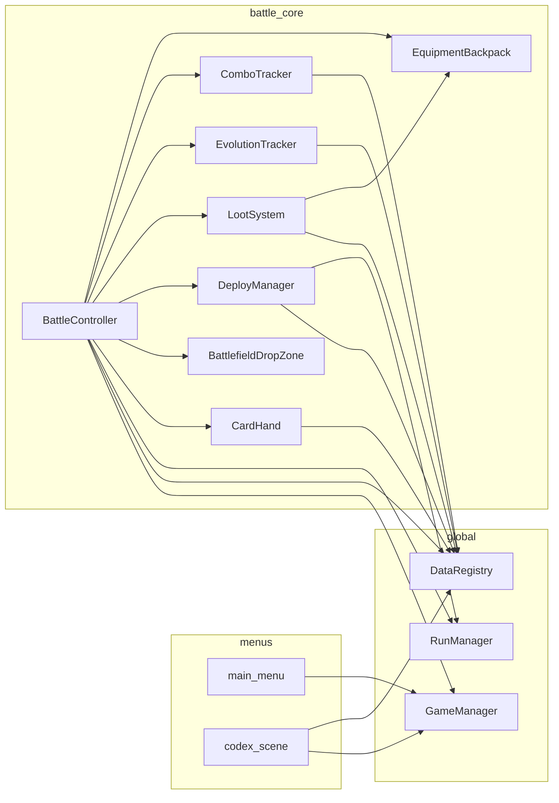

# 依赖与扩展

## 模块依赖（简化）

## 信号一览（战斗）

| 发送方 | 信号 | 接收 / 用途 |
|--------|------|-------------|
| `BattlefieldDropZone` | `card_dropped(id, pos)` | `BattleController._on_card_dropped` |
| `CardHand` | `hold_penalty_changed` | `BattleController._on_hold_penalty_changed` → 刷新 HoldSummary / 英雄条 |
| `CardHand` | `card_selected(id)` | 当前无外部监听（预留） |
| `Hero` | `died` | Game Over / Run 失败 |
| `Hero` | `stats_changed` | 可接 UI；内部 `refresh_display` 也会发 |
| `Monster` | `died` | 掉落入背包 + 从 `_monsters` 移除 + 击杀计数 |
| `EquipmentBackpack` | `backpack_changed` | `BattleController._refresh_backpack_ui` |
| `EquipmentInventory` | `equipment_changed` | 英雄 `refresh_display`、装备栏 |
| `DeployManager` | `monster_deployed(monster)` | 注册怪物 |
| `DeployManager` | `monster_deployed_with_zone(monster, zone)` | 记录部署区域、ComboTracker |
| `EvolutionTracker` | `evolution_triggered(path_id, tier)` | 应用演化效果、刷新 UI |
| `EvolutionTracker` | `kill_count_changed(type, count)` | 刷新演化进度 UI |
| `EvolutionTracker` | `hybrid_triggered(hybrid_id)` | 应用混合被动、刷新混合 UI |
| `ComboTracker` | `combo_triggered(recipe, monster)` | 应用 combo 效果、显示 combo 提示 |

## 推荐扩展点

| 需求 | 建议改动位置 |
|------|----------------|
| 新怪物 / 装备 | `resources/monsters/*.tres`、`resources/equipment/*.tres`；临时贴图见 `tools/` 工具链 |
| 新持仓 debuff | 创建 `resources/buffs/hold_xxx.tres`（BuffDef），`MonsterData.hold_debuff` 引用 |
| 新 Buff/Debuff（技能/装备） | 创建 `BuffDef` .tres → `buff_container.add_buff(def, source)` |
| 时间型 buff | `BuffDef.duration_type = TIMED`，`BuffContainer.tick()` 自动管理 |
| 次数型 buff | `BuffDef.duration_type = COUNTED` + `trigger_event`，外部调 `notify_event()` |
| 新演化路径 | 创建 `resources/evolutions/xxx.tres`，在 `_apply_evolution_effect` 加 match 分支 |
| 新混合被动 | 在 `HybridEvolution.get_all()` 加条目，在 `_apply_hybrid_effect` 加 match 分支 |
| 新 Combo | 创建 `resources/combos/xxx.tres`，若新效果类型需在 `ComboRecipe.EffectType` 加枚举 |
| 调整普攻距离 | `data/game_config.gd` → `ATTACK_RANGE`、`HERO_ATTACK_RANGE` |
| 调整弃牌 / 属性下限 | `game_config.gd` → `DISCARD_COOLDOWN_SEC`、`MIN_*` |
| 调整新卡冷却 | `game_config.gd` → `CARD_COOLDOWN_SEC` |
| 调整掉落概率 | `resources/loot_table_default.tres` 权重 |
| 调整卡池权重 | `resources/card_pool_default.tres` |
| 调整 Run 参数 | `autoload/run_manager.gd` → `TOTAL_BATTLES`、`KILL_REQUIREMENTS` 等 |
| 新 Boss | `data/boss_data.gd` → `get_all()` 中添加新 Boss 定义 |
| 调整 Boss 特性 | `boss_data.gd` 属性字段 + `battle_controller.gd` → `_tick_boss_effects` |
| 调整背包容量 | `scripts/battle/equipment_backpack.gd` → `MAX_SLOTS` |
| 新品质/词缀 | `data/equipment_quality.gd` / `data/equipment_affix.gd` |
| 新手牌上限 | `card_hand.gd` → `MAX_CARDS` |
| 新场景入口 | `game_manager.gd` 增加路径 + 新 `.tscn` |

## 已实现 P1 功能

以下原 backlog 项已落地：

| 功能 | 实现位置 |
|------|----------|
| 分怪掉落池 | `MonsterData.preferred_loot` + `LootSystem._pick_preferred_loot()` |
| 落点预览 | `BattlefieldDropZone` 十字准星 + 区域名称标签 |
| 卡面威胁星级 | `CardHand._get_threat_stars()` / `_get_threat_color()` |
| 手牌满提示 | `CardHand._rebuild_ui()` 标题显示 "[满]" + 橙色高亮 |

## 已移除机制（勿恢复）

以下模块**不存在于当前代码**，文档与规则均标记为已删除：

| 机制 | 原设计 | 移除原因 |
|------|--------|----------|
| `DeploySlot` / 部署格 | 点击固定格子部署 | 用户要求改为拖放 |
| `MonsterSpawner` | 定时自动生成环境怪 | 用户要求移除自动刷怪 |
| 点击手牌即时出牌 | 点卡即召唤 | 改为拖拽部署 |
| 地面掉落物 `LootDrop` | 击杀后生成地面物品点击拾取 | 改为自动入背包 |
| 掉落卡牌 | 击杀掉落怪物卡进手牌 | 用户要求移除 |
| 定时发牌 | 每 3s 自动发一张牌 | 改为部署后满手补牌 |

接手时若需恢复，须**用户明确需求**并同步更新 `development-scope.md` 与本目录。

## 与 Cursor Rules 的关系

| 文档 | 作用 |
|------|------|
| `docs/knowledge/*` | **是什么**：模块职责、结构、数据流 |
| `docs/rules/development-scope.md` | **能改什么**：允许 / 禁止的功能边界 |

二者冲突时，以用户最新指示为准；结构变更后应同时更新两处。
