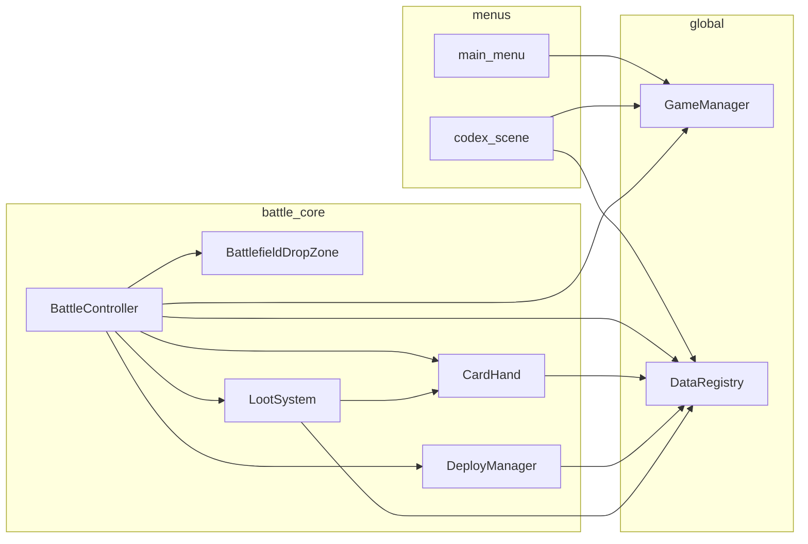

# 依赖与扩展

## 模块依赖（简化）

## 信号一览（战斗）

| 发送方 | 信号 | 接收 / 用途 |
|--------|------|-------------|
| `BattlefieldDropZone` | `card_dropped(id, pos)` | `BattleController._on_card_dropped` |
| `CardHand` | `hold_penalty_changed` | `BattleController._on_hold_penalty_changed` → 刷新 HoldSummary / 英雄条 |
| `CardHand` | `card_selected(id)` | 当前无外部监听（预留） |
| `Hero` | `died` | Game Over |
| `Hero` | `stats_changed` | 可接 UI；内部 `refresh_display` 也会发 |
| `Monster` | `died` | 掉落 + 从 `_monsters` 移除 |
| `LootDrop` | `picked_up` | `LootSystem._on_loot_picked` |
| `EquipmentInventory` | `equipment_changed` | 英雄 `refresh_display`、装备栏 |
| `DeployManager` | `monster_deployed` | 暂无监听（扩展点） |

## 推荐扩展点

| 需求 | 建议改动位置 |
|------|----------------|
| 新怪物 / 装备 | `resources/monsters/*.tres`、`resources/equipment/*.tres` |
| 持仓负面 | `HoldPenaltyStats` 子资源 + `hold_bleed_per_sec` |
| 调整普攻距离 | `data/game_config.gd` → `ATTACK_RANGE` |
| 调整弃牌 / 属性下限 | `game_config.gd` → `DISCARD_COOLDOWN_SEC`、`MIN_*` |
| 调整掉落概率 | `loot_system.gd` 顶部常量 |
| 新手牌上限 | `card_hand.gd` → `MAX_CARDS` |
| 新场景入口 | `game_manager.gd` 增加路径 + 新 `.tscn` |

## 未实现 backlog（P1，勿当已落地）

| 功能 | 说明 | 参考 |
|------|------|------|
| 分怪掉落池 | 哥布林 ↑ 装备概率，史莱姆 ↑ 卡 | [06-v2](./06-v2-手牌持仓压力设计.md) |
| 落点预览 | 拖放时标示落点/威胁 | 同上 |
| 卡面威胁星级 | ★～★★★ | 同上 |
| 手牌满无提示 | `add_card` 失败时无 UI 反馈 | [03-战斗系统.md](./03-战斗系统.md) |
| 弃牌进度条 | 当前仅 Label 倒计时 | 可选增强 |

## 已移除机制（勿恢复）

以下模块**不存在于当前代码**，文档与规则均标记为已删除：

| 机制 | 原设计 | 移除原因 |
|------|--------|----------|
| `DeploySlot` / 部署格 | 点击固定格子部署 | 用户要求改为拖放 |
| `MonsterSpawner` | 定时自动生成环境怪 | 用户要求移除自动刷怪 |
| 点击手牌即时出牌 | 点卡即召唤 | 改为拖拽部署 |

接手时若需恢复，须**用户明确需求**并同步更新 `development-scope.mdc` 与本目录。

## 与 Cursor Rules 的关系

| 文档 | 作用 |
|------|------|
| `docs/knowledge/*` | **是什么**：模块职责、结构、数据流 |
| `.cursor/rules/development-scope.mdc` | **能改什么**：允许 / 禁止的功能边界 |

二者冲突时，以用户最新指示为准；结构变更后应同时更新两处。
