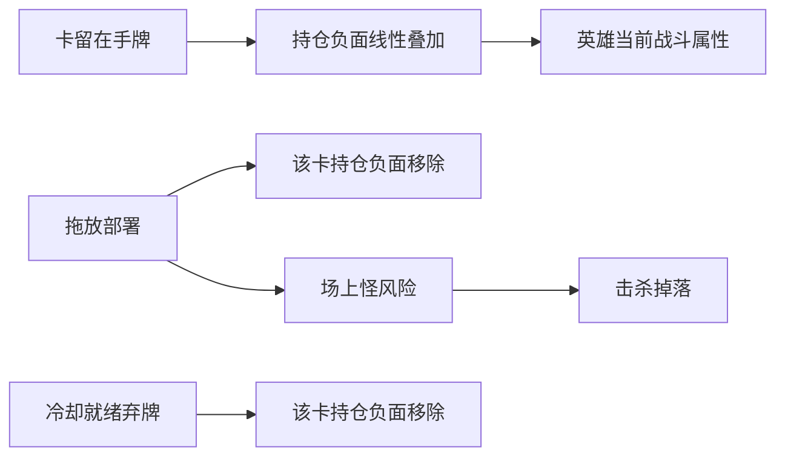

# v2 设计备忘：手牌持仓压力与部署策略

> **状态**：**已实现**（2025-05）；数值以 [08-v2-数值初稿.md](./08-v2-数值初稿.md) 为准，行为以 [03-战斗系统.md](./03-战斗系统.md) 为准。  
> **玩法**：即时制（无回合）；英雄为玩家方；部署怪 = 承担场上风险以换取击杀掉落。

## 设计目标

让玩家部署怪物有明确理由，而非「可铺可不铺」：

- **持仓成本**：未打出的牌持续削弱英雄战斗能力（战斗耦合负面为主）。
- **部署收益**：打出后结束该牌的持仓负面，并承担场上怪的风险与掉落。
- **可读**：一张卡一条负面 + 手牌区汇总；避免 Loop Hero 式隐式规则堆叠。

## 已定原则（产品拍板）

| 项 | 决定 |
|----|------|
| 负面主形式 | **战斗耦合**（降攻 / 降防 / 降攻速等）；**失血为高级负面**，仅用于高威胁怪（哥布林） |
| 叠加 | 多张手牌 **`HoldPenaltyStats` 线性求和**；合计不 clamp，生效时见 `GameConfig` 下限 |
| 弃牌 | **即时制冷却 10s**：冷却结束可弃 **1** 张；局内次数无上限 |
| 弃牌代价 | **无代价** |
| 节奏 | **即时制**，文案与系统均不使用「回合」 |

## 系统分层

### 1. 持仓负面（Hold Penalty）

- 数据源：`MonsterData.hold_penalty: HoldPenaltyStats`（**勿用 `CombatStats`**）+ 可选 `hold_bleed_per_sec`。
- **叠加**：攻 / 防 / 攻速 / 失血分别求和。
- **生效**：`Hero.get_combat_stats()` → `apply_penalty` 后攻 ≥ 1、防 ≥ 0、攻速 ≥ 0.4。
- **失血**：`BattleController` 每秒 `take_damage`，与普攻受伤共用死亡判定。

### 2. 物种分工（拍板数值，见 08 §3）

| 物种 | 拿着：攻 | 拿着：防 | 失血 (/s) | 部署后 |
|------|----------|----------|-----------|--------|
| **史莱姆** | 0 | -1 | 0 | 轻税、可短留 |
| **狼** | -2 | 0 | 0 | 中税 |
| **哥布林** | -2 | -1 | 0.6 | 重税 + 失血 |

高收益卡 = 高持仓税 + 高部署风险；**分怪掉落池**仍为 P1（见 [05-依赖与扩展.md](./05-依赖与扩展.md)）。

### 3. 弃牌（Discard）

- 冷却 **10s**（`GameConfig.DISCARD_COOLDOWN_SEC`）；UI：`DiscardCooldown` Label。
- 交互：点击选手牌 → `BtnDiscard`；无扣血。
- 效果：移除该卡及持仓负面；卡不进场。

### 4. UI（已实现）

- 单卡：`拿着:攻-2 防-1` 等（`CardHand.format_card_hold_hint`）。
- 汇总：`HoldSummary` — `持仓：攻-5 防-2 失血1.0/s`。
- 顶栏：拖拽部署 + 留牌 debuff + 弃牌说明。

## 与现有模块的接点

| 模块 | 职责 |
|------|------|
| `MonsterData` | `hold_penalty: HoldPenaltyStats`、`hold_bleed_per_sec` |
| `CardHand` | `get_hold_penalty_sum()`、`hold_penalty_changed`、`discard_card()` |
| `Hero` | `get_combat_stats()`、`refresh_display()` |
| `BattleController` | 失血 tick、弃牌冷却、连接 `HoldSummary` / 弃牌按钮 |

## 明确不做（v2 范围内）

- 回合制资源
- 单卡多种持仓主负面
- 打出后仍保留持仓负面
- 弃牌扣血或其它弃牌代价
- v2 初版对「合计」做属性 soft cap（仅生效下限）

## playtest 旋钮

见 [08-v2-数值初稿.md](./08-v2-数值初稿.md) §10（英雄 HP、哥布林失血、弃牌冷却等）。
