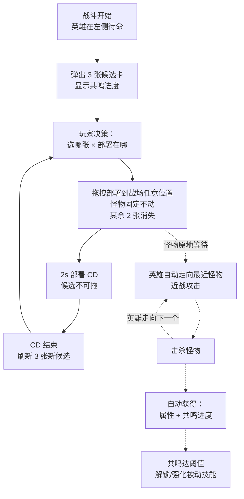
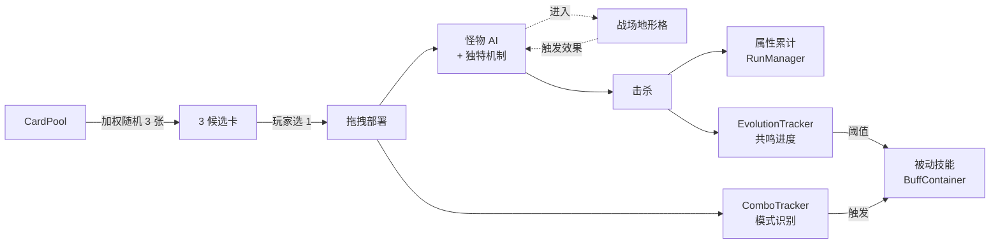

# v5 设计定稿：策略性重做（极简部署）

> **状态**：设计定稿，待实施。  
> **前置版本**：v4（4 场 Run + Boss + 装备 + 持仓 debuff + 演化）  
> **核心变更**：重做战斗循环；玩家唯一操作 = 从 3 张候选选 1 张拖到战场某位置。

---

## 1. 设计哲学与核心约束

### 1.1 核心约束（不可违反）

> **玩家在整个 Run 中只做一件事：从 3 张候选里选 1 张拖到战场某个位置。其余 2 张自动弃掉。**

任何系统设计若不能服务于以下**两轴决策**，不得加入：

| 决策轴 | 评估维度 |
|---|---|
| **选哪张** | 共鸣进度 / 怪物机制 / combo 序列 / 场上局势 / 精英变体 |
| **部署在哪** | 英雄巡猎路线 / 怪物间相互作用 / 死亡位置（地形协同）/ 聚拢 vs 分散 |

### 1.2 已砍掉的玩家操作

- 主动技能释放 → 全被动
- 弃牌按钮 → 自动弃
- 抉择 3 选 1 弹窗 → 不做
- 英雄移动 → 英雄自动走向最近怪物（巡猎模式）
- 装备穿/卸 → 装备系统整体删除
- 部署远近分区 → 战场为整片自由区（全场可部署）

### 1.3 策略性来源

所有策略性必须通过"选哪张 + 部署在哪"两轴展现，由以下系统支撑：

- **战场地形**：让"部署在哪"有意义
- **怪物机制差异化**：让"选哪张"有意义
- **被动技能化共鸣**：让击杀目标有方向
- **Combo 模式识别**：让部署序列有价值
- **精英变体**：增加抽卡随机性的赌博感

---

## 2. 新战斗循环



**节奏估算**：
- 部署 CD 2s → 每场约 50-80 次部署决策
- 单场 4-5 分钟
- 单 Run 4 场，约 200-300 次决策

---

## 3. 战场地形系统

战场存在两类空间效果，概念上严格区分：

| 类别 | 生成方式 | 持续时间 | 半径 |
|------|----------|----------|------|
| **地图地形**（MapTerrainZone） | 开局随机生成 3-4 个 | 永久（整场战斗） | 80px |
| **范围效果**（TerrainCell） | 共鸣被动击杀时召唤 | 6-8 秒临时 | 40px |

### 3.1 地图地形（永久）

开局在战场上随机生成 3-4 个地图地形区域，永久存在。影响部署选择和击杀收益。

| 地形 | 视觉色 | 效果 |
|------|--------|------|
| 灵泉 | 浅蓝 | 在此击杀怪物 → 英雄回复 5 HP |
| 水晶矿 | 紫粉 | 在此击杀怪物 → 属性增益 ×1.5 |
| 岩地 | 灰褐 | 部署在此的怪物 +2 防御 |
| 荆棘丛 | 深绿 | 站在此的怪物持续受 3 伤/s |

### 3.2 范围效果（临时，由被动召唤）

- 召唤源：共鸣路径 Tier II/III（见 §5.3）— 击杀对应怪种概率触发
- 效果位置 = 怪物死亡位置（= 部署位置，因怪物固定不动）
- 临时效果，持续 6s（Tier II）/ 8s（Tier III），到期前 1s 淡出
- 半径 40px；同一格效果按进入/tick/死亡触发独立计算
- 多个效果可叠加（不检查距离）

### 3.3 6 种范围效果

| 范围效果 | 视觉色 | 效果 | 数值 |
|---|---|---|---|
| 共鸣祭坛 | 紫色 | 在此格死亡的怪 → 共鸣进度 ×2 | +1 杀算作 +2 杀；弹"+共鸣!" |
| 荆棘地 | 棕色 | 进入此格的怪每秒受真伤 | 4 伤/s；弹伤害数 |
| 圣光圈 | 金色 | 怪首次进入时眩晕 | 2.5s（每只仅一次）；弹"眩晕!" |
| 暗影域 | 深紫 | **此格内**的怪 → 移速+50%, 攻+30%（出格即失效） | 弹"暗影!" |
| 共鸣节点 | 蓝色 | 在此格死亡触发范围爆炸 | 半径 100px, 12 伤害（敌方）；弹"爆炸 12!" |
| 腐毒地 | 绿色 | 此格死亡留毒池 | 半径 60px, 5s, 2 伤/s（伤英雄）；弹"毒池!" |

**触发反馈**：每次效果触发，范围效果区脉冲高亮 + 在事件位置浮动文字（向上飘 0.9s 淡出）。

### 3.4 召唤映射（共鸣路径 → 范围效果）

每条共鸣路径 Tier II 解锁"击杀对应怪种概率召唤范围效果"被动；Tier III 提升概率 + 持续时间。

| 路径 | 怪 | 召唤效果 | T2 概率/时长 | T3 概率/时长 |
|---|---|---|---|---|
| 共生 | 史莱姆 | 共鸣祭坛 | 35% / 6s | 60% / 8s |
| 磐石 | 石像鬼 | 共鸣节点 | 35% / 6s | 60% / 8s |
| 剧毒 | 毒蛇 | 腐毒地 | 50% / 6s | 80% / 8s |
| 凶残 | 哥布林 | 荆棘地 | 35% / 6s | 60% / 8s |
| 幽影 | 蝙蝠 | 圣光圈 | 35% / 6s | 60% / 8s |
| 亡灵 | 骷髅 | 暗影域 | 35% / 6s | 60% / 8s |
| 追猎 | 狼 | 共鸣祭坛 | 35% / 6s | 60% / 8s |

毒蛇本身的"死亡留毒池"机制（v5-4 怪物机制）仍然保留；剧毒共鸣额外召唤一个"腐毒地"范围效果。

---

## 4. 怪物机制差异化

### 4.1 基础数值（沿用 v3-8 调整）

| 怪 | 攻 | HP | 防 | 攻速 | 移速 |
|---|---|---|---|---|---|
| 史莱姆 | 2 | 15 | 0 | 0.8 | 35 |
| 蝙蝠 | 3 | 10 | 0 | 1.6 | 85 |
| 毒蛇 | 4 | 12 | 0 | 1.8 | 95 |
| 狼 | 5 | 25 | 0 | 1.0 | 55 |
| 哥布林 | 6 | 20 | 0 | 1.2 | 70 |
| 骷髅 | 6 | 35 | 2 | 0.8 | 60 |
| 石像鬼 | 8 | 40 | 1 | 0.7 | 30 |

### 4.2 独特机制（v5 新增）

| 怪 | 独特机制 | 实现要点 |
|---|---|---|
| 史莱姆 | 死亡分裂 2 只小史莱姆 | 小史莱姆：HP 5、攻 1、攻速 0.8、移速 35；击杀计共鸣 0.5 |
| 蝙蝠 | 飞行（无视地形伤害与眩晕） | 进入地形时不触发任何效果 |
| 狼 | 200px 内有同族存活 → 攻速 +50% | 实时检测，离开范围即失效 |
| 哥布林 | 死亡触发范围爆炸 | 半径 80px, 8 真伤（敌我皆受，含英雄） |
| 骷髅 | 死后留 2s 墓碑 | 墓碑：HP 10、无攻击；被打碎才计入击杀 |
| 石像鬼 | 永久防御光环 | 半径 150px 内友方怪 +2 防（存活期间始终生效） |
| 毒蛇 | 死亡留毒池 | 半径 60px, 5s, 2 伤/s（仅对英雄外的敌方？不，对英雄。下文澄清） |

**毒蛇毒池伤害目标**：仅对英雄无效（避免毒蛇成为反向自杀工具）。  
→ **决定**：毒池仅对**精英变体怪 / 召唤物（友方骷髅）**生效，普通玩家部署的怪不受。  
→ **简化为**：毒池**不产生伤害**，仅作为「腐毒地」地形的临时版本（视觉一致，但无效果触发）。  
→ **最终决定**：毒池对英雄造成伤害 2/s（玩家自食苦果，鼓励远离英雄部署毒蛇）。

### 4.3 与地形/范围效果的协同示例

**地图地形**：
- 史莱姆部署在灵泉 → 击杀回血 5 + 分裂 2 小（各死亡再回血）
- 怪物部署在水晶矿 → 击杀属性增益 ×1.5
- 怪物部署在岩地 → +2 防（更难击杀但更有价值）
- 怪物部署在荆棘丛 → 持续受 3 伤/s（自动削血）

**范围效果**（共鸣被动召唤）：
- 史莱姆死在共鸣祭坛 → +2 共鸣 + 分裂 2 小（各 +1 共鸣，若也死在祭坛 +2 each）
- 蝙蝠飞行无视范围效果伤害与眩晕
- 哥布林部署在密集怪群处 → 死亡爆炸连锁
- 石像鬼永久防御光环 + 部署位置影响英雄巡猎路线

---

## 5. 被动技能化共鸣

### 5.1 总体规则

- 7 条共鸣路径（与现有 EvolutionPath 一一对应）
- 每条路径 3 阶（Tier I/II/III）
- 所有效果均**被动触发**：事件 / 概率 / 内置 CD
- 阈值相对 v4 降低（缓解早期推进慢的风险）
- 共鸣进度 = 击杀该种怪的累计计数（含分裂小史莱姆 0.5、精英变体 2.0）
- 跨场保留（沿用 RunManager）

### 5.2 共鸣阈值（v5 调整）

| 路径 | 对应怪 | Tier I | Tier II | Tier III |
|---|---|---|---|---|
| 狼·追猎 | 狼 | 5 | 12 | 20 |
| 蝙蝠·幽影 | 蝙蝠 | 5 | 12 | 20 |
| 石像鬼·磐石 | 石像鬼 | 4 | 9 | 15 |
| 哥布林·凶残 | 哥布林 | 4 | 9 | 15 |
| 史莱姆·共生 | 史莱姆 | 7 | 15 | 25 |
| 骷髅·亡灵 | 骷髅 | 4 | 9 | 15 |
| 毒蛇·剧毒 | 毒蛇 | 5 | 11 | 18 |

### 5.3 21 个被动技能

#### 狼·追猎（输出型）
- **T1**：击杀后下次攻击必暴击（伤害 ×2）
- **T2**：暴击伤害提升至 ×2.5
- **T3**：暴击触发时重置普攻 CD（=即时再攻一次）

#### 蝙蝠·幽影（闪避型）
- **T1**：受击 20% 闪避
- **T2**：闪避后下次攻击伤害 +30%（5s 内有效）
- **T3**：连续闪避叠加 +5%/层（最高 60%），下次受击清零

#### 石像鬼·磐石（防御型）
- **T1**：每 5s 获得 1 层护盾（吸 5 伤，最多 3 层）
- **T2**：每 3s 获得 1 层
- **T3**：护盾破碎时反伤 10 给最近敌人

#### 哥布林·凶残（处决型）
- **T1**：攻击 30% 概率处决（敌方 HP < 30% 时伤害 ×1.5）
- **T2**：处决概率 +20% (= 50%)，阈值 +5% (= 35%)
- **T3**：处决击杀回血 +5

#### 史莱姆·共生（恢复型）
- **T1**：受击 25% 概率回血 5
- **T2**：概率 +15% (= 40%)，回血量 +3
- **T3**：满血时溢出回血转护盾（上限 20）

#### 骷髅·亡灵（召唤型）
- **T1**：击杀 20% 概率召唤友方骷髅（持续 5s, HP 20, 攻 4）
- **T2**：概率 +20% (= 40%)
- **T3**：友方骷髅死亡留亡灵法阵（半径 80px, 4s, 3 伤/s 给敌方）

#### 毒蛇·剧毒（DoT 型）
- **T1**：攻击叠加"毒"层（最多 5 层），毒每秒 1 伤/层
- **T2**：毒达 5 层时引爆，造成 15 伤
- **T3**：引爆时毒传染最近 2 个敌人（各 2 层起）

### 5.4 8 个混合共鸣（机制化）

任意两路径都达到 Tier I 时自动解锁。改造为**机制**而非属性：

| 混合 | 路径组合 | 名称 | 机制效果 |
|---|---|---|---|
| 1 | 追猎+幽影 | 暗夜猎手 | 闪避后下次攻击必暴击 |
| 2 | 追猎+凶残 | 嗜血猛兽 | 处决击杀必触发"暴击 buff" |
| 3 | 幽影+剧毒 | 暗影毒刺 | 闪避后下次攻击叠加 2 层毒 |
| 4 | 磐石+共生 | 不动如山 | 护盾破碎时回血 5 |
| 5 | 磐石+亡灵 | 永恒守护 | 受致命伤时召唤 2 只骷髅（每场一次） |
| 6 | 凶残+剧毒 | 毒裁者 | 毒引爆伤害提升至 25 |
| 7 | 亡灵+共生 | 生死融合 | 友方骷髅死亡时英雄回血 5 |
| 8 | 追猎+亡灵 | 亡灵猎手 | 击杀必召唤友方骷髅（无概率） |

---

## 6. 手牌系统（3 选 1）

### 6.1 行为规则

- 战斗开始 → 立即弹出 3 张候选
- 候选区显示 3 张卡（横排）
- 玩家拖拽其中 1 张到战场 → 其余 2 张消失
- 部署后 2s CD 期间候选保持显示但**不可拖**（视觉灰显 + 倒计时）
- CD 结束 → 旧候选消失，**刷新**新 3 张
- **方案 B**：刷新仅在 CD 结束后发生，避免 CD 中误操作

### 6.2 候选生成规则

- 从全卡池按权重随机
- **保证 3 张不重复**（无 3 张同种）
- 每张候选独立 10% 概率为精英变体
- 第一版**不做构筑**，全卡池随机；后续可扩展

### 6.3 卡池权重（沿用 v3）

| 怪 | 权重 |
|---|---|
| 史莱姆 | 4.0 |
| 蝙蝠 | 3.0 |
| 狼 | 2.0 |
| 毒蛇 | 2.0 |
| 哥布林 | 1.5 |
| 石像鬼 | 1.5 |
| 骷髅 | 1.5 |

### 6.4 候选卡 UI

每张候选卡显示：

```
┌──────────────┐
│ [怪物图标]    │
│ 史莱姆        │
│ 死亡分裂      │
│ 共鸣 3/7      │
└──────────────┘
```

- 图标 + 名称
- **机制简述**（一句话，如 "死亡分裂" / "飞行" / "群体光环"）
- **共鸣进度**：当前 / 下一阶阈值
- 精英变体：金色边框 + "精英" 标签

### 6.5 下一批预览

底部"下一批"行显示**CD 结束后将刷新的 3 张候选**（缩小、灰显，不可拖）：
- CD 期间稳定显示，玩家可提前规划当前部署后的衔接
- 部署消耗当前候选 → next 顶替 current，新 next 重新生成
- 实现：`NextHandPreview` 节点 + `CardHand.set_next_preview()` 注入

---

## 7. 击杀属性自动叠加

### 7.1 规则

- 击杀任意怪 → 立即增加对应属性
- 无玩家干预，无选择
- 跨场保留（沿用 RunManager）
- 小史莱姆击杀：按 0.5 计算（属性增量减半，可能取整）

### 7.2 数值表

| 怪 | 击杀提供 | 备注 |
|---|---|---|
| 史莱姆 | +2 max_hp | 同时回 +2 HP |
| 蝙蝠 | +0.03 攻速 | 累计 33 杀 = +1.0 攻速 |
| 狼 | +0.4 攻 | float 累计 |
| 哥布林 | +0.6 攻 | float 累计 |
| 骷髅 | +0.25 防 | float 累计 |
| 石像鬼 | +0.5 防 | float 累计 |
| 毒蛇 | +0.25 穿甲 | 4 杀 = +1 穿甲（int 应用） |

**实现**：属性累计存为 float，应用到英雄时按规则取整（int 属性 floor）。

### 7.3 精英变体击杀

- 击杀精英版怪 → 属性增量 ×2 + 共鸣进度 ×2

---

## 8. Combo 系统（模式识别重做）

### 8.1 设计思路

砍掉 v3 的 10 个固定配方，改为**模式识别**：根据部署序列的特征触发，而非硬编码组合。

### 8.2 3 类模式

| 模式 | 触发条件 | 效果 |
|---|---|---|
| 生态专精 | 4s 内同种连铺 3 只 | 该种下一只击杀共鸣 ×1.5（即 +1.5） |
| 异种联动 | 部署序列匹配特定 2-pair（见下） | 触发对应英雄 buff / 战场事件 |
| 密集部署 | 4s 内部署 4 只（任意种） | 场上现有怪中随机 1 只升级为精英（HP/攻 ×1.3）|

### 8.3 异种联动配方（精简到 5 个）

| 序列 | 名称 | 效果 |
|---|---|---|
| 狼 → 蝙蝠 | 暗夜突袭 | 英雄攻速 +0.3, 3s |
| 哥布林 → 史莱姆 | 暴怒之欲 | 英雄攻 +3, 3s |
| 石像鬼 → 骷髅 | 不朽壁垒 | 英雄防 +3, 3s |
| 毒蛇 → 史莱姆 | 毒沼蔓延 | 战场所有敌方怪叠 1 层毒 |
| 骷髅 → 毒蛇 | 亡者瘟疫 | 召唤亡灵法阵（半径 80px, 4s, 3 伤/s）|

### 8.4 模式追踪

ComboTracker（沿用现有架构）维护 4s 滑动窗口：
- 记录每次部署的怪种 + 时间戳
- 每次部署后检查 3 类模式
- 多模式同时触发时，全部生效

---

## 9. Run 结构

### 9.1 保留 v4 框架

| 参数 | 值 |
|---|---|
| TOTAL_BATTLES | 4 |
| HEAL_BETWEEN_BATTLES | 20% max_hp |
| DIFFICULTY_MULTIPLIERS | 1.0 / 1.2 / 1.5 / 2.0 |

### 9.2 调整项

| 参数 | 旧值 (v4) | 新值 (v5 调参) | 原因 |
|---|---|---|---|
| KILL_REQUIREMENTS | 15/18/22/25 | **14/22/30/Boss** | 后期场次要求拉高，避免后期太轻松 |
| MIN_BATTLE_TIME | 90s | **45s** | 不再要求漫长存活，快速 build 可快速过关 |
| DIFFICULTY_MULTIPLIERS | 1.0/1.2/1.5/2.0 | **1.0/1.4/1.9/2.5** | 后期怪威胁拉高，匹配玩家成长 |
| Boss HP | 250-500 | **+25%**（312/437/500/625）| 主线 Boss 战需要 build 配合 |

### 9.3 跨场保留

- 英雄 HP（含 max_hp 累计）
- 所有属性累计（攻/防/攻速/穿甲）
- 共鸣进度（kill_counts）+ active_evolutions
- 混合共鸣（active_hybrids）
- ❌ **不再保留装备**（装备系统已删除）

### 9.4 Boss 战（第 4 场）

- 沿用 v4 的 4 个 Boss + 预览面板
- **不生成地形**（Boss 战为纯战斗）
- 玩家仍可继续部署普通怪
- Boss 死亡 → Run 通关

---

## 10. 战斗常量（v5）

| 常量 | 值 | 备注 |
|---|---|---|
| ATTACK_RANGE | 48 | 怪物近战 |
| HERO_ATTACK_RANGE | 48 | 英雄近战（需走近怪物才能攻击） |
| HERO_MOVE_SPEED | 180 | 英雄巡猎移动速度 |
| DEPLOY_COOLDOWN_SEC | 2.0 | 部署 CD |
| HAND_SIZE | 3 | 候选数量（固定） |
| ELITE_CHANCE | 0.1 | 精英刷新概率 |
| COMBO_WINDOW_SEC | 4.0 | combo 窗口 |
| MAP_TERRAIN_COUNT | 3-4 | 开局随机生成地图地形数量 |
| MIN_ATTACK | 1 | 属性下限 |
| MIN_DEFENSE | 0 | 属性下限 |
| MIN_ATTACK_SPEED | 0.4 | 属性下限 |

### 已删除常量

- `CARD_COOLDOWN_SEC`（新卡冷却不再存在）
- `DISCARD_COOLDOWN_SEC`（弃牌系统已删除）
- `MAX_CARDS`（手牌固定 3 张候选）
- `DEPLOY_ZONE_NEAR_MAX` / `DEPLOY_ZONE_MID_MAX`（部署分区已删除）

---

## 11. 必砍清单

### 11.1 整体删除的脚本/资源

| 模块 | 文件 | 删除原因 |
|---|---|---|
| 装备系统 | `data/equipment_data.gd`, `equipment_quality.gd`, `equipment_affix.gd`, `equipment_instance.gd` | 装备系统整体删除 |
| 装备运行时 | `scripts/battle/equipment_inventory.gd`, `equipment_backpack.gd` | 同上 |
| 装备资源 | `resources/equipment/*.tres` | 同上 |
| 持仓负面 | `data/hold_penalty_stats.gd` | 持仓 debuff 移除 |
| 持仓 buff 资源 | `resources/buffs/hold_*.tres` | 同上 |
| 旧 Combo 配方 | `resources/combos/*.tres` 中除新 5 个外 | 模式识别替代 |

### 11.2 字段/逻辑级删除

| 位置 | 内容 |
|---|---|
| `MonsterData` | `hold_debuff`, `hold_bleed_per_sec`, `preferred_loot` |
| `Hero` | `inventory` 字段及相关 refresh 逻辑 |
| `BattleController` | `_tick_hold_bleed`, 弃牌相关字段, 装备背包 UI |
| `BattlefieldDropZone` | 近/中/远分区逻辑、视觉 |
| `LootSystem` | 装备掉落分支（保留击杀通知给 GameManager）|
| `CardHand` | 7 张手牌循环、持仓 debuff 添加/移除、弃牌 API |
| `GameConfig` | 见 §10.1 已删除常量 |

### 11.3 GameManager 调整

- 保留 `codex_unlocked_monsters`
- 删除 `codex_unlocked_equipment`（图鉴中装备页删除或留空）

---

## 12. 保留并强化的旧系统

| 系统 | 状态 |
|---|---|
| RunManager 4 场结构 | 保留，调 KILL_REQUIREMENTS / MIN_BATTLE_TIME |
| Boss 系统（4 Boss + 预览 + 特效 tick） | 保留 |
| EvolutionTracker（击杀统计） | 保留，效果改为解锁被动技能 |
| HybridEvolution | 保留，效果改为机制 |
| BuffContainer | 保留，用于 TIMED/COUNTED 被动技能 |
| BuffDef / BuffInstance | 保留（被动技能产物用 buff 实现）|
| ComboTracker | 保留，匹配逻辑改为模式识别 |
| MonsterData / DataRegistry | 保留，删除装备/持仓相关字段 |
| 跨场保留 HP / 共鸣 / 混合 | 保留 |

---

## 13. 数据流（新）



---

## 14. 分阶段实现路径

每阶段结束时游戏可玩，便于回归测试。

| 阶段 | 内容 | 工作量 |
|---|---|---|
| **v5-1 清理** | 删装备/持仓/弃牌/分区/旧combo；击杀直接累计属性；移除相关 UI | 1 天 |
| **v5-2 手牌重做** | 7 张手牌 → 3 张候选 + CD 后刷新 + 共鸣进度显示 | 0.5 天 |
| **v5-3 地形系统** | 战场地形格生成 + 6 种地形效果 + 视觉 | 1.5 天 |
| **v5-4 怪物机制** | 7 种怪每只独特机制（AI + 死亡触发 + 飞行） | 2 天 |
| **v5-5 被动技能** | 21 个被动 + 8 混合改造 + 触发事件挂接 | 2 天 |
| **v5-6 新 combo** | 模式识别（生态专精/异种联动/密集部署）+ 精英变体 | 1 天 |
| **v5-7 调参 + Boss 适配** | 数值平衡 + Boss 战适配 + Run 参数调整 | 1.5 天 |
| **合计** | | **~9.5 天** |

### 14.1 各阶段验收要点

- **v5-1**：能进入战斗，怪物部署，击杀后属性数值变化；无装备 UI、无持仓 UI、无弃牌按钮
- **v5-2**：仅 3 张候选可见，选 1 后其余消失，CD 2s 后刷新；共鸣进度正确显示
- **v5-3**：战场可见 4 个地形格，怪进入触发对应效果
- **v5-4**：7 种怪各自机制可观察（分裂/飞行/光环/爆炸/墓碑/静止/毒池）
- **v5-5**：共鸣阈值达到时被动技能自动生效，可在 UI 中看到激活列表
- **v5-6**：连续部署触发模式提示；精英版怪以金色边框出现
- **v5-7**：4 场 Run 通关时长 15-20 分钟，胜率合理

---

## 15. playtest 调参旋钮

| 太难 | 太易 |
|---|---|
| 共鸣阈值整体 -1 | 共鸣阈值整体 +1 |
| 精英概率 10%→5% | 精英概率 10%→15% |
| 部署 CD 2.0→1.5 | 部署 CD 2.0→2.5 |
| 击杀属性增量 +20% | 击杀属性增量 -20% |
| 地形格 4→5（+1 利好地形）| 地形格 4→3 |
| KILL_REQUIREMENTS ↓ | KILL_REQUIREMENTS ↑ |

---

## 16. 风险与对策

| 风险 | 对策 |
|---|---|
| 早期共鸣推进慢，前 30s 无反馈 | Tier I 阈值已降到 4-7；可加开局送 1 共鸣 |
| 卡池权重决定能走通哪条线 | playtest 精细调；后续支持构筑可解决 |
| 3 张候选都不想要 → 玩家挫败 | 接受为策略性来源；后备：弃牌点累计触发效果 |
| 地形 + combo + 被动 同时设计，复杂度高 | 严格按 v5-1~v5-7 分阶段，每阶段可玩可回归 |
| 哥布林死亡爆炸误伤自家怪 | 设计意图：迫使玩家思考位置；不修正 |

---

## 17. 与其他文档的关系

| 文档 | 关系 |
|---|---|
| `docs/rules/development-scope.md` | 实施 v5 时需同步更新允许范围（删装备/持仓，加地形/被动技能） |
| `docs/knowledge/03-战斗系统.md` | v5 实施完成后整体重写 |
| `docs/knowledge/02-数据层.md` | 删装备/持仓相关 Resource，新增地形/被动技能数据 |
| `docs/knowledge/06,07,08-v2-*.md` | 标记为"历史归档"，v5 取代 |
| `CLAUDE.md` | v5 实施完成后更新核心循环描述 |
